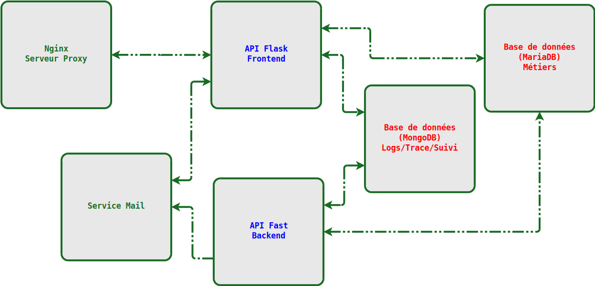
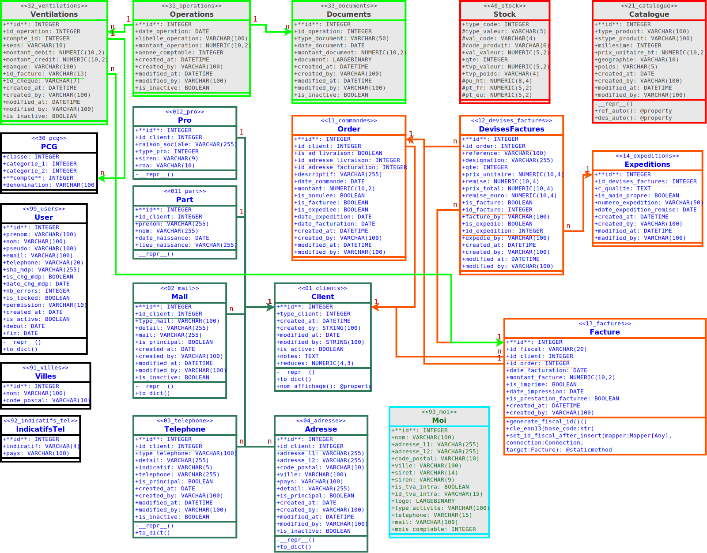

# 🏢 ACFC - Application de Gestion d'Entreprise

[](https://www.python.org/)
[](https://flask.palletsprojects.com/)
[](https://mariadb.org/)
[](https://docs.docker.com/compose/)

**ACFC** (Accounting, Customer Relationship Management, Billing & Stock Management) est une solution web intégrée pour la gestion d'une entreprise de commercialisation de prêt à poster développée en Python Flask.

## 🏗️ Architecture globale

L'architecture de l'application ACFC repose sur une approche micro-services, chaque service étant conteneurisé avec Docker. Les principaux composants sont :

- **Frontend** : Interface utilisateur développée en HTML5, CSS3 et JavaScript.
- **Backend** : API RESTful construite avec Python 3.12 et Flask.
- **Base de données** : MariaDB pour les données relationnelles et MongoDB pour les logs.
- **Serveur** : Nginx en tant que reverse proxy et serveur statique.
- **Cache** : Redis pour la gestion des sessions et des files d'attente.
- **Mails** : Service de gestion des emails.

[](documentation/architecture-docker.svg)

## 🎯 Fonctionnalités

### Modules Métiers

- **👥 CRM** - Gestion de la relation client et contacts
- **📦 Catalogue** - Gestion des produits et services  
- **💼 Commercial** - Devis, commandes et suivi commercial
- **💰 Comptabilité** - Facturation et plan comptable
- **📊 Stocks** - Inventaire et gestion des mouvements

### Sécurité

- 🔐 **Authentification Argon2** - Hachage sécurisé résistant aux GPU
- 🛡️ **Sessions chiffrées** - Protection contre XSS et CSRF
- 🚫 **Protection force brute** - Verrouillage après échecs répétés
- ⏱️ **Expiration automatique** - Timeout de session 30 minutes

## 🏗️ Architecture

### Stack Technologique

```text
Frontend:  HTML5 + CSS3 + JavaScript + Jinja2
Backend:   Python 3.12 + Flask + SQLAlchemy  
Database:  MariaDB (données) + MongoDB (logs)
Server:    Waitress WSGI + Nginx (reverse proxy)
Deploy:    Docker + Docker Compose
```

### Base de données

### Diagramme de la Base de Données



> Le schéma ci-dessus illustre les principales tables et relations du modèle de données ACFC.  
> Pour plus de détails, consultez le fichier [UML.svg](documentation/UML.svg) dans le dossier documentation.

## 🚀 Démarrage Rapide

### Avec Docker (Recommandé)

```bash
# Clone du projet
git clone <repository>
cd acfc_base

# Configuration environnement
cp .env.example .env
# Éditer .env avec vos paramètres de base de données

# Démarrage de tous les services
docker-compose up -d

# Vérification du déploiement
curl http://localhost:80
```

### Installation Manuelle

```bash
# Environnement virtuel Python
python -m venv venv
source venv/bin/activate  # Linux/Mac
venv\Scripts\activate     # Windows

# Installation des dépendances
pip install -r requirements-app.txt

# Configuration base de données (MariaDB requis)
# Éditer le fichier .env avec vos paramètres

# Démarrage de l'application
cd app_acfc
python application.py
```

## 📁 Structure du Projet

```text
acfc_base/
├── app_acfc/                   # Application Flask principale
│   ├── application.py          # Point d'entrée et configuration
│   ├── modeles.py             # Modèles SQLAlchemy (BDD)
│   ├── services.py            # Services (sécurité, sessions)
│   ├── contextes_bp/          # Modules métiers (Blueprints)
│   ├── templates/             # Templates HTML Jinja2
│   └── statics/               # Ressources CSS/JS/Images
├── mariadb/                   # Configuration base de données
├── nginx/                     # Configuration proxy
├── docker-compose.yml         # Orchestration services
└── requirements-app.txt       # Dépendances Python
```

## ⚙️ Configuration

### Variables d'Environnement (.env)

```bash
# Base de données MariaDB
DB_HOST=localhost
DB_PORT=3306  
DB_NAME=******
DB_USER=******
DB_PASSWORD=mot_de_passe_securise
DB_ROOT_PASSWORD=mot_de_passe_root

# Sécurité sessions
SESSION_PASSKEY=cle_secrete_longue_et_aleatoire

# MongoDB (logs)
MONGO_INITDB_ROOT_USERNAME=admin
MONGO_INITDB_ROOT_PASSWORD=mot_de_passe_mongo
MONGO_INITDB_DATABASE=******
```

## 🐳 Services Docker

| Service | Port | Description |
|---------|------|-------------|
| `acfc-app` | 5000 | Application Flask + Waitress |
| `acfc-nginx` | 80/443 | Reverse proxy et fichiers statiques |
| `acfc-db` | 3306 | Base de données MariaDB |  
| `acfc-logs` | 27017 | Base MongoDB pour les logs |

### Commandes Utiles

```bash
# Démarrage
docker-compose up -d

# Logs en temps réel  
docker-compose logs -f

# Rebuild après modifications
docker-compose up -d --build

# Arrêt propre
docker-compose down

# Reset complet (⚠️ perte de données)
docker-compose down -v
```

## 📊 Modèle de Données

### Entités Principales

- **Utilisateurs** (`99_users`) - Authentification et autorisation
- **Clients** (`01_clients`) - CRM principal (particuliers/professionnels)  
- **Contacts** (`02_mail`, `03_telephone`, `04_adresse`) - Moyens de contact
- **Orders** (`11_commandes`, `12_lignes_commande`) - Gestion commerciale
- **Comptabilité** (`30_pcg`, `31_operations`) - Plan comptable et écritures
- **Produits** (`20_produits`, `21_mouvements_stock`) - Catalogue et stocks

### Architecture Polymorphe

```sql
-- Client principal (point central)
01_clients (id, type_client, id_part, id_pro, created_at...)

-- Spécialisations selon le type
011_part (id, prenom, nom, date_naissance...)     -- Particuliers
012_pro (id, raison_sociale, siren, rna...)       -- Professionnels
```

## 🔧 Développement

### Standards de Code

- **PEP 8** - Style Python standardisé
- **Type Hints** - Annotations de type obligatoires  
- **Docstrings** - Documentation complète des fonctions
- **Tests** - Coverage minimum 80% (Pytest)

### Architecture Modulaire

Chaque module métier est un **Blueprint Flask** autonome :

```python
# Exemple : contextes_bp/clients.py
clients_bp = Blueprint('clients', __name__, url_prefix='/clients')

@clients_bp.route('/rechercher')
def clients_list():
    """Interface de recherche clients"""
    return render_template('base.html', context='clients')
```

### Sécurité Implémentée

```python
# services.py - Configuration Argon2
PasswordHasher(
    time_cost=4,        # 4 itérations
    memory_cost=2**16,  # 64KB mémoire (anti-GPU) 
    parallelism=3,      # 3 threads parallèles
    hash_len=32,        # Hash 256 bits
    salt_len=16         # Sel 128 bits
)
```

## 🚀 Roadmap

### Version 1.1 (Q4 2025)

- [ ] API REST complète avec documentation OpenAPI
- [ ] Dashboard temps réel avec métriques KPI
- [ ] Export avancé (PDF, Excel, CSV)
- [ ] Système de notifications (email, SMS)

### Version 2.0 (2026)  

- [ ] ~~Authentification OAuth2/SSO~~
- [ ] Multi-tenant (plusieurs entreprises)
- [ ] Application mobile React Native

## 📖 Documentation

- **[Documentation complète](DOCUMENTATION.md)** - Guide technique détaillé
- **Code source** - Commentaires inline complets
- **API** - Documentation auto-générée (à venir)

## 🤝 Contribution

1. Fork du projet
2. Création d'une branche feature (`git checkout -b feature/nouvelle-fonctionnalite`)
3. Commit des modifications (`git commit -am 'Ajout nouvelle fonctionnalité'`)
4. Push vers la branche (`git push origin feature/nouvelle-fonctionnalite`)  
5. Création d'une Pull Request

## 📄 Licence

Ce projet est sous licence propriétaire. Tous droits réservés.

## 👥 Équipe

**ACFC Development Team** :

- **Rémi Verschuur** - Lead Developer
  - Architecture & Backend
  - Frontend & UX/UI  
  - DevOps & Infrastructure
  - Quality Assurance

---

💼 *Application développée pour les besoins de gestion d'entreprise moderne*  
📅 *Dernière mise à jour : Août 2025*
